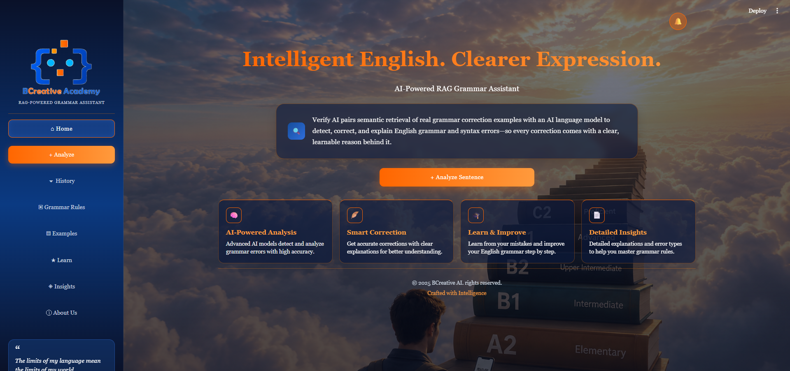

# Verity AI - RAG Grammar Assistant

  

## Overview
**Verity AI** pairs semantic retrieval of real grammar correction examples with an advanced AI language model to detect, correct, and explain English grammar and syntax errors—so every correction comes with a clear, learnable reason behind it.

## Key Features
* **AI-Powered Analysis:** Advanced AI models detect and analyze grammar errors with high accuracy.
* **Smart Correction:** Get accurate corrections with clear explanations for better understanding.
* **Learn & Improve:** Learn from your mistakes and improve your English grammar step by step.
* **Detailed Insights:** Detailed explanations and error types to help you master grammar rules.

## Project Structure
* `02_preprocessing.py` — Text cleaning and preparation
* `03_chunking.py` — Text splitting strategies
* `04_vector_representation.py` — Embedding generation
* `05_create_chroma_store.py` — Vector database setup
* `06_retrieve_context.py` — Retrieval logic
* `07_prompting.py` — LLM prompt construction
* `08_evaluate_jfleg.py` — Evaluation scripts
* `config.py` — Configuration settings
* `requirements.txt` — Project dependencies
* `streamlit_app.py` — Main Streamlit application entry point